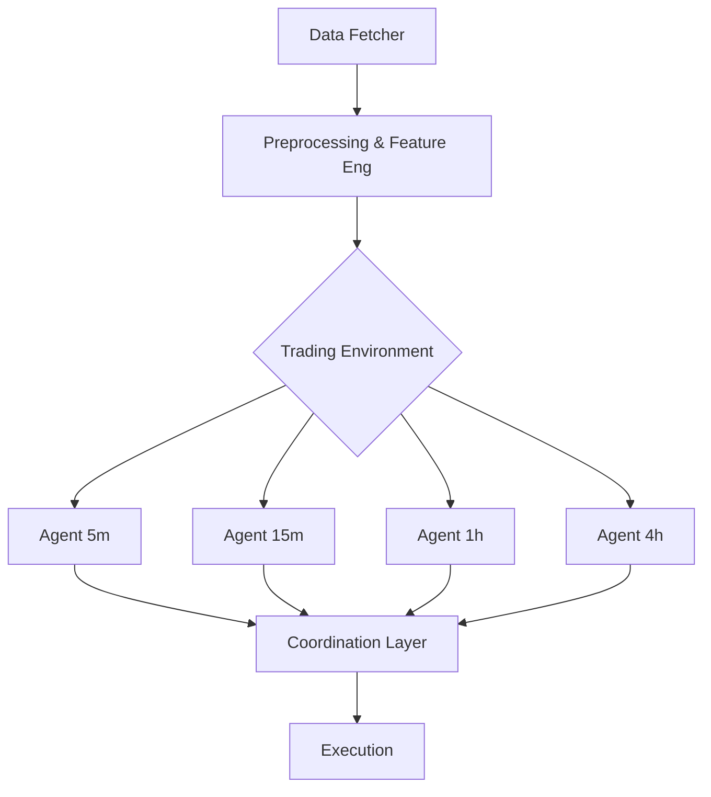

# System Patterns

## Architecture Integration
The system follows a standard Deep Reinforcement Learning pipeline with a focus on modularity to support multi-agent experiments.

## Key Technical Decisions
1.  **Stable Baselines3**: Chosen for reliable, bug-free implementations of PPO.
2.  **Per-Timeframe Agents**: Decoupling agents allows for parallel training and specialized feature engineering per timeframe.
3.  **Gymnasium Interface**: Standard environment interface ensures compatibility with SB3 and other RL libraries.

## Design Patterns
-   **Factory Pattern**: For creating environment instances with different configurations (timeframes).
-   **Wrapper Pattern**: Using Gym Wrappers for normalization (`VecNormalize`), stacking, and custom observation transformations.
-   **Strategy Pattern**: For swappable reward functions and action schemes.
